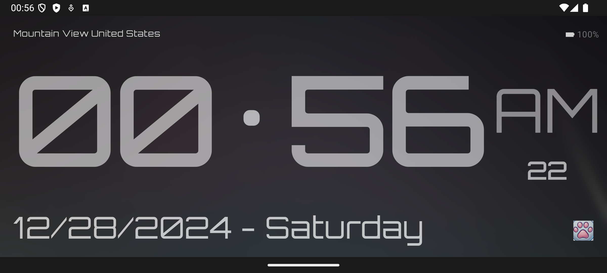

# MeowTime: Timekeeping with a Purr-pose 🕒🐾

Welcome to **MeowTime**, the app that combines sleek timekeeping with an irresistible feline twist! Whether you're a cat lover, design enthusiast, or just someone who needs a stylish clock, MeowTime has you covered. Oh, and did we mention it helps you summon your cat? 😸

## App Preview 

## 🌟 Features That Set MeowTime Apart:

### 1. **Flip Clock Animation**
Experience the hypnotic charm of flipping digits. Hours, minutes, and seconds transition smoothly, making you enjoy every passing moment (literally).

### 2. **Dynamic Backgrounds**
Time isn’t static, and neither is MeowTime. The background adapts to the time of day:
- **Morning Bliss 🌅**: Start your day with warm sunrise vibes.
- **Afternoon Brightness 🌞**: Keep calm with a soothing daylight backdrop.
- **Evening Serenity 🌌**: Wind down with tranquil starry skies.

### 3. **Dynamic Offset Anti-Burn-In Technology 🖥️**
Afraid of screen burn-in? Don’t worry! MeowTime takes screen protection seriously. Our **dynamic offset animations** ensure that clock elements subtly shift positions over time, preventing screen burn-in while maintaining a stylish and modern look.

### 4. **AM/PM Display**
Is it morning or evening? MeowTime’s clear **AM/PM indicator** makes sure you always know where you are in the rhythm of your day.

### 5. **Real-Time Battery Status 🔋**
MeowTime doesn’t just tell time—it keeps you informed. Check your battery level at a glance with an elegant visual indicator.

### 6. **Location-Based Greetings 📍**
Wondering where you are? (No judgment!) MeowTime greets you with your current city and country, making you feel at home wherever you are.

### 7. **Date & Day Display 📅**
Stay organized and stylish. MeowTime displays the current date and day of the week, so you’re always in sync.

### 8. **Cat-Calling Audio Button 🎵🐈**
This is where things get *meow-nificent*! Tap the **cat icon** button to play a **realistic cat meow sound**. It’s perfect for:
- Summoning your furry friend to snuggle before bedtime.
- Entertaining your cat (or yourself) with a playful meow.
- Impressing your friends with your clock’s unexpected *catitude*.

### 9. **Dark Mode Magic 🌑**
For night owls (human or feline), MeowTime features a sleek dark mode that’s easy on the eyes and pawsitively stunning.

## 🛠️ Tech That Makes the Magic Happen:
- **Kotlin & Jetpack Compose**: Cutting-edge tools for smooth performance.
- **Geocoder Wizardry**: Converts boring coordinates into location awesomeness.
- **Battery Listener**: Keeps you informed about your device’s energy.
- **Dynamic Offset Animation**: Protects your screen while looking fabulous.
- **Feline Audio Fun**: Perfectly tuned meow sounds for maximum cat-attraction potential.

## 🚀 Why Wait? Get MeowTime Now!
With MeowTime, you don’t just track time—you make memories, summon cats, and enjoy life with a touch of whimsy. Clone it, install it, and bring your furry friend closer today.README
